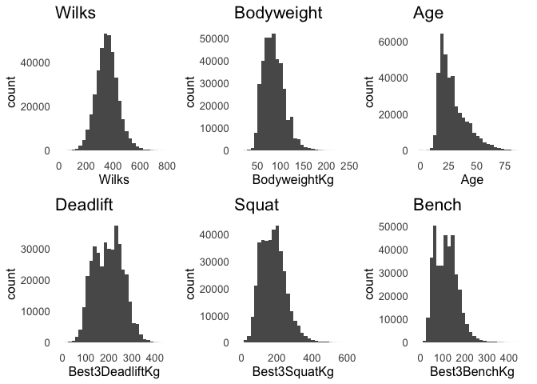
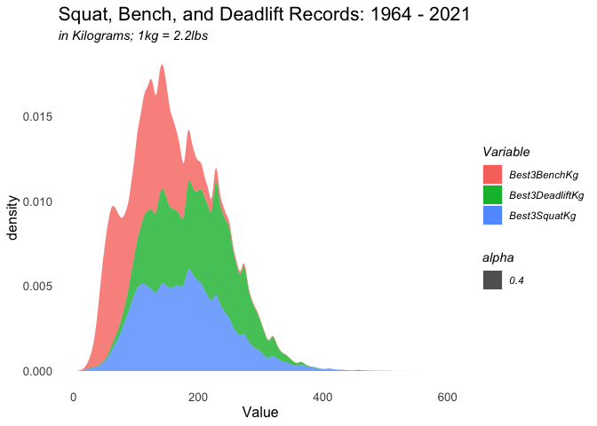
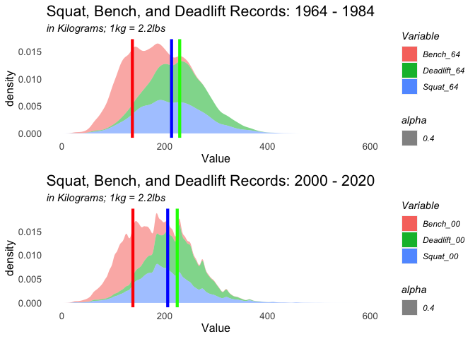
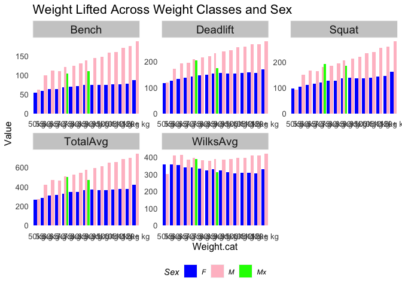
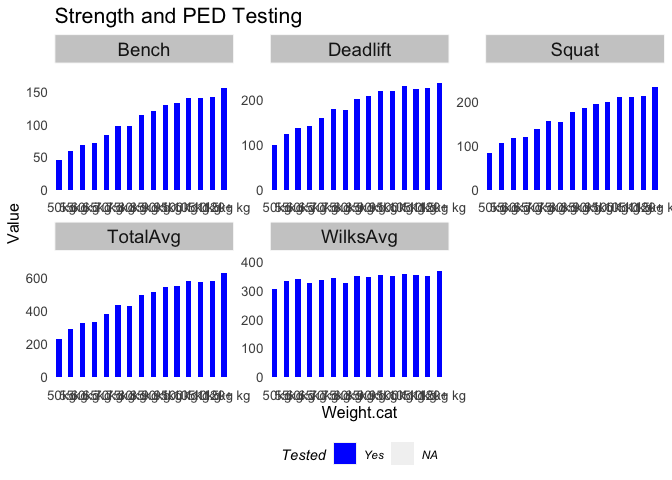

Among powerlifters, there are many tropes and debates about our sport.


```r
grid.arrange(  
  
  ggplot(PL, aes(x=Wilks)) +
  geom_histogram() +
  labs(title = "Wilks") +
  plotTheme(), 
  
  ggplot(PL, aes(x=BodyweightKg)) +
  geom_histogram() +
  labs(title = "Bodyweight") +
  plotTheme(), 
  
  ggplot(PL, aes(x=Age)) +
  geom_histogram() +
  labs(title = "Age") +
  plotTheme(), 
  
  ggplot(PL, aes(x=Best3DeadliftKg)) +
  geom_histogram() +
  labs(title = "Deadlift") +
  plotTheme(), 
  
  ggplot(PL, aes(x=Best3SquatKg)) +
  geom_histogram() +
  labs(title = "Squat") +
  plotTheme(),
  
  ggplot(PL, aes(x=Best3BenchKg)) +
  geom_histogram() +
  labs(title = "Bench") +
  plotTheme(),
  
  ncol=3)
```

<!-- -->

```r
#all records
SBD %>%
  gather(Variable, Value) %>%
  ggplot() +
  stat_density(aes(x=Value, fill = Variable, alpha = 0.4)) +
  stat_density(aes(x=Value, fill = Variable, alpha = 0.4)) +
  labs(title = "Squat, Bench, and Deadlift Records: 1964 - 2021", subtitle = "in Kilograms; 1kg = 2.2lbs") +
  plotTheme()
```

<!-- -->
 
Powerlifting averages have slightly decreased since the early days despite increases in sports science, equipment, and knowledge. What happened?

```r
#calculate mean weights for each lift during each period
means_2000 <- PL_2000 %>%
  summarize(mean_squat=mean(Best3SquatKg),
            mean_bench=mean(Best3BenchKg),
            mean_dead=mean(Best3DeadliftKg))

  
means_1964 <- PL_1964 %>%
  summarize(mean_squat=mean(Best3SquatKg),
            mean_bench=mean(Best3BenchKg),
            mean_dead=mean(Best3DeadliftKg))


grid.arrange(
  #1964-1984
  SBD_1964 %>%
  ggplot() +
  stat_density(aes(x=Value, fill = Variable, alpha = 0.4), colour = "transparent") +
    xlim(0, 600) +
     geom_vline(data = means_1964, aes(xintercept = mean_squat), size=1.5, color="blue", size = 1.5) +
     geom_vline(data = means_1964, aes(xintercept = mean_bench), size=1.5, color="red", size = 1.5) +
     geom_vline(data = means_1964, aes(xintercept = mean_dead), size=1.5, color="green", size = 1.5) +
  labs(title = "Squat, Bench, and Deadlift Records: 1964 - 1984", subtitle = "in Kilograms; 1kg = 2.2lbs") +
  plotTheme(),

#2000-2020
SBD_2000 %>%
  ggplot() +
  stat_density(aes(x=Value, fill = Variable, alpha = 0.4), colour = "transparent") +
      xlim(0, 600) +
     geom_vline(data = means_2000, aes(xintercept = mean_squat), size=1.5, color="blue", size = 1.5) +      geom_vline(data = means_2000, aes(xintercept = mean_bench), size=1.5, color="red", size = 1.5) +
    geom_vline(data = means_2000, aes(xintercept = mean_dead), size=1.5, color="green", size = 1.5) +
  labs(title = "Squat, Bench, and Deadlift Records: 2000 - 2020", subtitle = "in Kilograms; 1kg = 2.2lbs") +
  plotTheme(),
ncol = 1)
```

<!-- -->

```r
# SBD_Compare %>%
#   filter(Value < 410) %>%
#   ggplot() +
#   stat_density(aes(colour = Variable, x=Value), fill = "transparent") +
#   scale_colour_manual(values =c("purple", "lavender", "orange", "yellow", "forest green", "light green")) +
#     geom_vline(data = means_2000, aes(xintercept = mean_squat), size=1.5, color="forest green", size = 1.5) +
#     geom_vline(data = means_2000, aes(xintercept = mean_bench), size=1.5, color="purple", size = 1.5) +
#     geom_vline(data = means_2000, aes(xintercept = mean_dead), size=1.5, color="orange", size = 1.5) +
#     geom_vline(data = means_1964, aes(xintercept = mean_squat), size=1.5, color="light green", size = 1.5) +
#     geom_vline(data = means_1964, aes(xintercept = mean_bench), size=1.5, color="lavender", size = 1.5) +
#     geom_vline(data = means_1964, aes(xintercept = mean_dead), size=1.5, color="yellow", size = 1.5) +
#   labs(title = "Squat, Bench, and Deadlift Records: 2000 - 2020", subtitle = "in Kilograms; 1kg = 2.2lbs; Outliers Omitted") +
#   plotTheme() 
```


```r
Wilks.Summary <- PL %>%
  filter(AgeClass == "24-34") %>%
  dplyr::select(Weight.cat, AgeClass, Best3SquatKg, Best3BenchKg, Best3DeadliftKg, TotalKg, Wilks, Sex) %>%
    group_by(Weight.cat, Sex) %>%
    summarize(Squat = mean(Best3SquatKg, na.rm = T),
              Bench = mean(Best3BenchKg, na.rm = T),
              Deadlift = mean(Best3DeadliftKg, na.rm = T),
              TotalAvg = mean(TotalKg, na.rm = T),
              WilksAvg = mean(Wilks, na.rm = T))

kable(Wilks.Summary) %>%
  kable_styling() %>%
  footnote(general_title = "\n",
           general = "Weight, Sex and PL Outcomes")
```

<table class="table" style="margin-left: auto; margin-right: auto;">
 <thead>
  <tr>
   <th style="text-align:left;"> Weight.cat </th>
   <th style="text-align:left;"> Sex </th>
   <th style="text-align:right;"> Squat </th>
   <th style="text-align:right;"> Bench </th>
   <th style="text-align:right;"> Deadlift </th>
   <th style="text-align:right;"> TotalAvg </th>
   <th style="text-align:right;"> WilksAvg </th>
  </tr>
 </thead>
<tbody>
  <tr>
   <td style="text-align:left;"> 50kg </td>
   <td style="text-align:left;"> F </td>
   <td style="text-align:right;"> 95.53241 </td>
   <td style="text-align:right;"> 53.47832 </td>
   <td style="text-align:right;"> 117.8897 </td>
   <td style="text-align:right;"> 266.9003 </td>
   <td style="text-align:right;"> 359.5149 </td>
  </tr>
  <tr>
   <td style="text-align:left;"> 50kg </td>
   <td style="text-align:left;"> M </td>
   <td style="text-align:right;"> 91.66125 </td>
   <td style="text-align:right;"> 62.64167 </td>
   <td style="text-align:right;"> 119.8300 </td>
   <td style="text-align:right;"> 274.1321 </td>
   <td style="text-align:right;"> 300.8346 </td>
  </tr>
  <tr>
   <td style="text-align:left;"> 55kg </td>
   <td style="text-align:left;"> F </td>
   <td style="text-align:right;"> 103.00181 </td>
   <td style="text-align:right;"> 58.34616 </td>
   <td style="text-align:right;"> 125.9471 </td>
   <td style="text-align:right;"> 287.2947 </td>
   <td style="text-align:right;"> 356.3447 </td>
  </tr>
  <tr>
   <td style="text-align:left;"> 55kg </td>
   <td style="text-align:left;"> M </td>
   <td style="text-align:right;"> 150.53566 </td>
   <td style="text-align:right;"> 100.06374 </td>
   <td style="text-align:right;"> 172.6919 </td>
   <td style="text-align:right;"> 423.2912 </td>
   <td style="text-align:right;"> 411.4812 </td>
  </tr>
  <tr>
   <td style="text-align:left;"> 60kg </td>
   <td style="text-align:left;"> F </td>
   <td style="text-align:right;"> 111.44560 </td>
   <td style="text-align:right;"> 63.11105 </td>
   <td style="text-align:right;"> 134.1534 </td>
   <td style="text-align:right;"> 308.7097 </td>
   <td style="text-align:right;"> 356.1492 </td>
  </tr>
  <tr>
   <td style="text-align:left;"> 60kg </td>
   <td style="text-align:left;"> M </td>
   <td style="text-align:right;"> 166.41880 </td>
   <td style="text-align:right;"> 111.76544 </td>
   <td style="text-align:right;"> 192.8770 </td>
   <td style="text-align:right;"> 471.0611 </td>
   <td style="text-align:right;"> 415.5115 </td>
  </tr>
  <tr>
   <td style="text-align:left;"> 65kg </td>
   <td style="text-align:left;"> F </td>
   <td style="text-align:right;"> 114.21706 </td>
   <td style="text-align:right;"> 64.30328 </td>
   <td style="text-align:right;"> 137.1399 </td>
   <td style="text-align:right;"> 315.6598 </td>
   <td style="text-align:right;"> 342.1495 </td>
  </tr>
  <tr>
   <td style="text-align:left;"> 65kg </td>
   <td style="text-align:left;"> M </td>
   <td style="text-align:right;"> 162.81421 </td>
   <td style="text-align:right;"> 110.21962 </td>
   <td style="text-align:right;"> 194.9427 </td>
   <td style="text-align:right;"> 467.9768 </td>
   <td style="text-align:right;"> 384.5208 </td>
  </tr>
  <tr>
   <td style="text-align:left;"> 70kg </td>
   <td style="text-align:left;"> F </td>
   <td style="text-align:right;"> 120.49320 </td>
   <td style="text-align:right;"> 67.74262 </td>
   <td style="text-align:right;"> 142.8888 </td>
   <td style="text-align:right;"> 331.1245 </td>
   <td style="text-align:right;"> 339.3566 </td>
  </tr>
  <tr>
   <td style="text-align:left;"> 70kg </td>
   <td style="text-align:left;"> M </td>
   <td style="text-align:right;"> 181.22682 </td>
   <td style="text-align:right;"> 121.01183 </td>
   <td style="text-align:right;"> 208.5934 </td>
   <td style="text-align:right;"> 510.8322 </td>
   <td style="text-align:right;"> 397.1222 </td>
  </tr>
  <tr>
   <td style="text-align:left;"> 70kg </td>
   <td style="text-align:left;"> Mx </td>
   <td style="text-align:right;"> 192.50000 </td>
   <td style="text-align:right;"> 105.00000 </td>
   <td style="text-align:right;"> 205.0000 </td>
   <td style="text-align:right;"> 502.5000 </td>
   <td style="text-align:right;"> 388.5000 </td>
  </tr>
  <tr>
   <td style="text-align:left;"> 75kg </td>
   <td style="text-align:left;"> F </td>
   <td style="text-align:right;"> 125.95534 </td>
   <td style="text-align:right;"> 70.49949 </td>
   <td style="text-align:right;"> 147.9794 </td>
   <td style="text-align:right;"> 344.4341 </td>
   <td style="text-align:right;"> 334.6804 </td>
  </tr>
  <tr>
   <td style="text-align:left;"> 75kg </td>
   <td style="text-align:left;"> M </td>
   <td style="text-align:right;"> 184.75572 </td>
   <td style="text-align:right;"> 125.16758 </td>
   <td style="text-align:right;"> 216.4171 </td>
   <td style="text-align:right;"> 526.3403 </td>
   <td style="text-align:right;"> 381.1504 </td>
  </tr>
  <tr>
   <td style="text-align:left;"> 80kg </td>
   <td style="text-align:left;"> F </td>
   <td style="text-align:right;"> 127.25278 </td>
   <td style="text-align:right;"> 70.85669 </td>
   <td style="text-align:right;"> 148.4137 </td>
   <td style="text-align:right;"> 346.5230 </td>
   <td style="text-align:right;"> 323.3853 </td>
  </tr>
  <tr>
   <td style="text-align:left;"> 80kg </td>
   <td style="text-align:left;"> M </td>
   <td style="text-align:right;"> 193.50147 </td>
   <td style="text-align:right;"> 130.40529 </td>
   <td style="text-align:right;"> 220.7450 </td>
   <td style="text-align:right;"> 544.6511 </td>
   <td style="text-align:right;"> 380.6896 </td>
  </tr>
  <tr>
   <td style="text-align:left;"> 85kg </td>
   <td style="text-align:left;"> F </td>
   <td style="text-align:right;"> 135.74022 </td>
   <td style="text-align:right;"> 74.83583 </td>
   <td style="text-align:right;"> 154.8386 </td>
   <td style="text-align:right;"> 365.4143 </td>
   <td style="text-align:right;"> 330.0180 </td>
  </tr>
  <tr>
   <td style="text-align:left;"> 85kg </td>
   <td style="text-align:left;"> M </td>
   <td style="text-align:right;"> 205.76979 </td>
   <td style="text-align:right;"> 138.49823 </td>
   <td style="text-align:right;"> 233.4396 </td>
   <td style="text-align:right;"> 577.7073 </td>
   <td style="text-align:right;"> 388.9232 </td>
  </tr>
  <tr>
   <td style="text-align:left;"> 85kg </td>
   <td style="text-align:left;"> Mx </td>
   <td style="text-align:right;"> 183.69500 </td>
   <td style="text-align:right;"> 111.19500 </td>
   <td style="text-align:right;"> 174.9450 </td>
   <td style="text-align:right;"> 469.8350 </td>
   <td style="text-align:right;"> 313.4000 </td>
  </tr>
  <tr>
   <td style="text-align:left;"> 90kg </td>
   <td style="text-align:left;"> F </td>
   <td style="text-align:right;"> 137.99978 </td>
   <td style="text-align:right;"> 75.28457 </td>
   <td style="text-align:right;"> 156.2630 </td>
   <td style="text-align:right;"> 369.5471 </td>
   <td style="text-align:right;"> 322.6496 </td>
  </tr>
  <tr>
   <td style="text-align:left;"> 90kg </td>
   <td style="text-align:left;"> M </td>
   <td style="text-align:right;"> 213.15372 </td>
   <td style="text-align:right;"> 144.66645 </td>
   <td style="text-align:right;"> 239.9575 </td>
   <td style="text-align:right;"> 597.7767 </td>
   <td style="text-align:right;"> 385.2773 </td>
  </tr>
  <tr>
   <td style="text-align:left;"> 95kg </td>
   <td style="text-align:left;"> F </td>
   <td style="text-align:right;"> 136.04294 </td>
   <td style="text-align:right;"> 74.77090 </td>
   <td style="text-align:right;"> 153.1425 </td>
   <td style="text-align:right;"> 363.9551 </td>
   <td style="text-align:right;"> 311.8023 </td>
  </tr>
  <tr>
   <td style="text-align:left;"> 95kg </td>
   <td style="text-align:left;"> M </td>
   <td style="text-align:right;"> 220.06519 </td>
   <td style="text-align:right;"> 148.34992 </td>
   <td style="text-align:right;"> 244.9036 </td>
   <td style="text-align:right;"> 613.3182 </td>
   <td style="text-align:right;"> 388.2026 </td>
  </tr>
  <tr>
   <td style="text-align:left;"> 100kg </td>
   <td style="text-align:left;"> F </td>
   <td style="text-align:right;"> 135.88924 </td>
   <td style="text-align:right;"> 74.43554 </td>
   <td style="text-align:right;"> 154.5573 </td>
   <td style="text-align:right;"> 364.8819 </td>
   <td style="text-align:right;"> 306.3373 </td>
  </tr>
  <tr>
   <td style="text-align:left;"> 100kg </td>
   <td style="text-align:left;"> M </td>
   <td style="text-align:right;"> 234.30664 </td>
   <td style="text-align:right;"> 159.12875 </td>
   <td style="text-align:right;"> 255.0241 </td>
   <td style="text-align:right;"> 648.4587 </td>
   <td style="text-align:right;"> 397.8109 </td>
  </tr>
  <tr>
   <td style="text-align:left;"> 105kg </td>
   <td style="text-align:left;"> F </td>
   <td style="text-align:right;"> 138.93472 </td>
   <td style="text-align:right;"> 76.33454 </td>
   <td style="text-align:right;"> 156.7761 </td>
   <td style="text-align:right;"> 372.0451 </td>
   <td style="text-align:right;"> 307.7532 </td>
  </tr>
  <tr>
   <td style="text-align:left;"> 105kg </td>
   <td style="text-align:left;"> M </td>
   <td style="text-align:right;"> 237.84324 </td>
   <td style="text-align:right;"> 161.11313 </td>
   <td style="text-align:right;"> 256.8001 </td>
   <td style="text-align:right;"> 655.7564 </td>
   <td style="text-align:right;"> 396.0243 </td>
  </tr>
  <tr>
   <td style="text-align:left;"> 110kg </td>
   <td style="text-align:left;"> F </td>
   <td style="text-align:right;"> 141.87842 </td>
   <td style="text-align:right;"> 76.52046 </td>
   <td style="text-align:right;"> 159.4579 </td>
   <td style="text-align:right;"> 377.8567 </td>
   <td style="text-align:right;"> 308.8265 </td>
  </tr>
  <tr>
   <td style="text-align:left;"> 110kg </td>
   <td style="text-align:left;"> M </td>
   <td style="text-align:right;"> 253.43401 </td>
   <td style="text-align:right;"> 171.64423 </td>
   <td style="text-align:right;"> 266.1402 </td>
   <td style="text-align:right;"> 691.2181 </td>
   <td style="text-align:right;"> 409.3044 </td>
  </tr>
  <tr>
   <td style="text-align:left;"> 115kg </td>
   <td style="text-align:left;"> F </td>
   <td style="text-align:right;"> 144.56879 </td>
   <td style="text-align:right;"> 77.18459 </td>
   <td style="text-align:right;"> 156.4214 </td>
   <td style="text-align:right;"> 378.1748 </td>
   <td style="text-align:right;"> 306.1514 </td>
  </tr>
  <tr>
   <td style="text-align:left;"> 115kg </td>
   <td style="text-align:left;"> M </td>
   <td style="text-align:right;"> 259.37651 </td>
   <td style="text-align:right;"> 176.47814 </td>
   <td style="text-align:right;"> 266.4575 </td>
   <td style="text-align:right;"> 702.3118 </td>
   <td style="text-align:right;"> 411.9011 </td>
  </tr>
  <tr>
   <td style="text-align:left;"> 120+ kg </td>
   <td style="text-align:left;"> F </td>
   <td style="text-align:right;"> 160.93190 </td>
   <td style="text-align:right;"> 87.69532 </td>
   <td style="text-align:right;"> 170.0618 </td>
   <td style="text-align:right;"> 418.6889 </td>
   <td style="text-align:right;"> 331.0092 </td>
  </tr>
  <tr>
   <td style="text-align:left;"> 120+ kg </td>
   <td style="text-align:left;"> M </td>
   <td style="text-align:right;"> 279.05051 </td>
   <td style="text-align:right;"> 188.27562 </td>
   <td style="text-align:right;"> 277.7822 </td>
   <td style="text-align:right;"> 745.1078 </td>
   <td style="text-align:right;"> 421.8245 </td>
  </tr>
</tbody>
<tfoot>
<tr><td style="padding: 0; border: 0;" colspan="100%"><span style="font-style: italic;"><br></span></td></tr>
<tr><td style="padding: 0; border: 0;" colspan="100%">
<sup></sup> Weight, Sex and PL Outcomes</td></tr>
</tfoot>
</table>

```r
Wilks.Summary %>%
  unite(Weight.cat.Sex, Weight.cat, Sex, sep = ": ", remove = T) %>%
  gather(Variable, Value, -Weight.cat.Sex) %>%
  mutate(Value = round(Value, 2)) %>%
  spread(Weight.cat.Sex, Value) %>%
  kable() %>%
    kable_styling() %>%
    footnote(general_title = "\n",
             general = "Weight, Sex and PL Outcomes 2")
```

<table class="table" style="margin-left: auto; margin-right: auto;">
 <thead>
  <tr>
   <th style="text-align:left;"> Variable </th>
   <th style="text-align:right;"> 100kg: F </th>
   <th style="text-align:right;"> 100kg: M </th>
   <th style="text-align:right;"> 105kg: F </th>
   <th style="text-align:right;"> 105kg: M </th>
   <th style="text-align:right;"> 110kg: F </th>
   <th style="text-align:right;"> 110kg: M </th>
   <th style="text-align:right;"> 115kg: F </th>
   <th style="text-align:right;"> 115kg: M </th>
   <th style="text-align:right;"> 120+ kg: F </th>
   <th style="text-align:right;"> 120+ kg: M </th>
   <th style="text-align:right;"> 50kg: F </th>
   <th style="text-align:right;"> 50kg: M </th>
   <th style="text-align:right;"> 55kg: F </th>
   <th style="text-align:right;"> 55kg: M </th>
   <th style="text-align:right;"> 60kg: F </th>
   <th style="text-align:right;"> 60kg: M </th>
   <th style="text-align:right;"> 65kg: F </th>
   <th style="text-align:right;"> 65kg: M </th>
   <th style="text-align:right;"> 70kg: F </th>
   <th style="text-align:right;"> 70kg: M </th>
   <th style="text-align:right;"> 70kg: Mx </th>
   <th style="text-align:right;"> 75kg: F </th>
   <th style="text-align:right;"> 75kg: M </th>
   <th style="text-align:right;"> 80kg: F </th>
   <th style="text-align:right;"> 80kg: M </th>
   <th style="text-align:right;"> 85kg: F </th>
   <th style="text-align:right;"> 85kg: M </th>
   <th style="text-align:right;"> 85kg: Mx </th>
   <th style="text-align:right;"> 90kg: F </th>
   <th style="text-align:right;"> 90kg: M </th>
   <th style="text-align:right;"> 95kg: F </th>
   <th style="text-align:right;"> 95kg: M </th>
  </tr>
 </thead>
<tbody>
  <tr>
   <td style="text-align:left;"> Bench </td>
   <td style="text-align:right;"> 74.44 </td>
   <td style="text-align:right;"> 159.13 </td>
   <td style="text-align:right;"> 76.33 </td>
   <td style="text-align:right;"> 161.11 </td>
   <td style="text-align:right;"> 76.52 </td>
   <td style="text-align:right;"> 171.64 </td>
   <td style="text-align:right;"> 77.18 </td>
   <td style="text-align:right;"> 176.48 </td>
   <td style="text-align:right;"> 87.70 </td>
   <td style="text-align:right;"> 188.28 </td>
   <td style="text-align:right;"> 53.48 </td>
   <td style="text-align:right;"> 62.64 </td>
   <td style="text-align:right;"> 58.35 </td>
   <td style="text-align:right;"> 100.06 </td>
   <td style="text-align:right;"> 63.11 </td>
   <td style="text-align:right;"> 111.77 </td>
   <td style="text-align:right;"> 64.30 </td>
   <td style="text-align:right;"> 110.22 </td>
   <td style="text-align:right;"> 67.74 </td>
   <td style="text-align:right;"> 121.01 </td>
   <td style="text-align:right;"> 105.0 </td>
   <td style="text-align:right;"> 70.50 </td>
   <td style="text-align:right;"> 125.17 </td>
   <td style="text-align:right;"> 70.86 </td>
   <td style="text-align:right;"> 130.41 </td>
   <td style="text-align:right;"> 74.84 </td>
   <td style="text-align:right;"> 138.50 </td>
   <td style="text-align:right;"> 111.19 </td>
   <td style="text-align:right;"> 75.28 </td>
   <td style="text-align:right;"> 144.67 </td>
   <td style="text-align:right;"> 74.77 </td>
   <td style="text-align:right;"> 148.35 </td>
  </tr>
  <tr>
   <td style="text-align:left;"> Deadlift </td>
   <td style="text-align:right;"> 154.56 </td>
   <td style="text-align:right;"> 255.02 </td>
   <td style="text-align:right;"> 156.78 </td>
   <td style="text-align:right;"> 256.80 </td>
   <td style="text-align:right;"> 159.46 </td>
   <td style="text-align:right;"> 266.14 </td>
   <td style="text-align:right;"> 156.42 </td>
   <td style="text-align:right;"> 266.46 </td>
   <td style="text-align:right;"> 170.06 </td>
   <td style="text-align:right;"> 277.78 </td>
   <td style="text-align:right;"> 117.89 </td>
   <td style="text-align:right;"> 119.83 </td>
   <td style="text-align:right;"> 125.95 </td>
   <td style="text-align:right;"> 172.69 </td>
   <td style="text-align:right;"> 134.15 </td>
   <td style="text-align:right;"> 192.88 </td>
   <td style="text-align:right;"> 137.14 </td>
   <td style="text-align:right;"> 194.94 </td>
   <td style="text-align:right;"> 142.89 </td>
   <td style="text-align:right;"> 208.59 </td>
   <td style="text-align:right;"> 205.0 </td>
   <td style="text-align:right;"> 147.98 </td>
   <td style="text-align:right;"> 216.42 </td>
   <td style="text-align:right;"> 148.41 </td>
   <td style="text-align:right;"> 220.74 </td>
   <td style="text-align:right;"> 154.84 </td>
   <td style="text-align:right;"> 233.44 </td>
   <td style="text-align:right;"> 174.94 </td>
   <td style="text-align:right;"> 156.26 </td>
   <td style="text-align:right;"> 239.96 </td>
   <td style="text-align:right;"> 153.14 </td>
   <td style="text-align:right;"> 244.90 </td>
  </tr>
  <tr>
   <td style="text-align:left;"> Squat </td>
   <td style="text-align:right;"> 135.89 </td>
   <td style="text-align:right;"> 234.31 </td>
   <td style="text-align:right;"> 138.93 </td>
   <td style="text-align:right;"> 237.84 </td>
   <td style="text-align:right;"> 141.88 </td>
   <td style="text-align:right;"> 253.43 </td>
   <td style="text-align:right;"> 144.57 </td>
   <td style="text-align:right;"> 259.38 </td>
   <td style="text-align:right;"> 160.93 </td>
   <td style="text-align:right;"> 279.05 </td>
   <td style="text-align:right;"> 95.53 </td>
   <td style="text-align:right;"> 91.66 </td>
   <td style="text-align:right;"> 103.00 </td>
   <td style="text-align:right;"> 150.54 </td>
   <td style="text-align:right;"> 111.45 </td>
   <td style="text-align:right;"> 166.42 </td>
   <td style="text-align:right;"> 114.22 </td>
   <td style="text-align:right;"> 162.81 </td>
   <td style="text-align:right;"> 120.49 </td>
   <td style="text-align:right;"> 181.23 </td>
   <td style="text-align:right;"> 192.5 </td>
   <td style="text-align:right;"> 125.96 </td>
   <td style="text-align:right;"> 184.76 </td>
   <td style="text-align:right;"> 127.25 </td>
   <td style="text-align:right;"> 193.50 </td>
   <td style="text-align:right;"> 135.74 </td>
   <td style="text-align:right;"> 205.77 </td>
   <td style="text-align:right;"> 183.70 </td>
   <td style="text-align:right;"> 138.00 </td>
   <td style="text-align:right;"> 213.15 </td>
   <td style="text-align:right;"> 136.04 </td>
   <td style="text-align:right;"> 220.07 </td>
  </tr>
  <tr>
   <td style="text-align:left;"> TotalAvg </td>
   <td style="text-align:right;"> 364.88 </td>
   <td style="text-align:right;"> 648.46 </td>
   <td style="text-align:right;"> 372.05 </td>
   <td style="text-align:right;"> 655.76 </td>
   <td style="text-align:right;"> 377.86 </td>
   <td style="text-align:right;"> 691.22 </td>
   <td style="text-align:right;"> 378.17 </td>
   <td style="text-align:right;"> 702.31 </td>
   <td style="text-align:right;"> 418.69 </td>
   <td style="text-align:right;"> 745.11 </td>
   <td style="text-align:right;"> 266.90 </td>
   <td style="text-align:right;"> 274.13 </td>
   <td style="text-align:right;"> 287.29 </td>
   <td style="text-align:right;"> 423.29 </td>
   <td style="text-align:right;"> 308.71 </td>
   <td style="text-align:right;"> 471.06 </td>
   <td style="text-align:right;"> 315.66 </td>
   <td style="text-align:right;"> 467.98 </td>
   <td style="text-align:right;"> 331.12 </td>
   <td style="text-align:right;"> 510.83 </td>
   <td style="text-align:right;"> 502.5 </td>
   <td style="text-align:right;"> 344.43 </td>
   <td style="text-align:right;"> 526.34 </td>
   <td style="text-align:right;"> 346.52 </td>
   <td style="text-align:right;"> 544.65 </td>
   <td style="text-align:right;"> 365.41 </td>
   <td style="text-align:right;"> 577.71 </td>
   <td style="text-align:right;"> 469.84 </td>
   <td style="text-align:right;"> 369.55 </td>
   <td style="text-align:right;"> 597.78 </td>
   <td style="text-align:right;"> 363.96 </td>
   <td style="text-align:right;"> 613.32 </td>
  </tr>
  <tr>
   <td style="text-align:left;"> WilksAvg </td>
   <td style="text-align:right;"> 306.34 </td>
   <td style="text-align:right;"> 397.81 </td>
   <td style="text-align:right;"> 307.75 </td>
   <td style="text-align:right;"> 396.02 </td>
   <td style="text-align:right;"> 308.83 </td>
   <td style="text-align:right;"> 409.30 </td>
   <td style="text-align:right;"> 306.15 </td>
   <td style="text-align:right;"> 411.90 </td>
   <td style="text-align:right;"> 331.01 </td>
   <td style="text-align:right;"> 421.82 </td>
   <td style="text-align:right;"> 359.51 </td>
   <td style="text-align:right;"> 300.83 </td>
   <td style="text-align:right;"> 356.34 </td>
   <td style="text-align:right;"> 411.48 </td>
   <td style="text-align:right;"> 356.15 </td>
   <td style="text-align:right;"> 415.51 </td>
   <td style="text-align:right;"> 342.15 </td>
   <td style="text-align:right;"> 384.52 </td>
   <td style="text-align:right;"> 339.36 </td>
   <td style="text-align:right;"> 397.12 </td>
   <td style="text-align:right;"> 388.5 </td>
   <td style="text-align:right;"> 334.68 </td>
   <td style="text-align:right;"> 381.15 </td>
   <td style="text-align:right;"> 323.39 </td>
   <td style="text-align:right;"> 380.69 </td>
   <td style="text-align:right;"> 330.02 </td>
   <td style="text-align:right;"> 388.92 </td>
   <td style="text-align:right;"> 313.40 </td>
   <td style="text-align:right;"> 322.65 </td>
   <td style="text-align:right;"> 385.28 </td>
   <td style="text-align:right;"> 311.80 </td>
   <td style="text-align:right;"> 388.20 </td>
  </tr>
</tbody>
<tfoot>
<tr><td style="padding: 0; border: 0;" colspan="100%"><span style="font-style: italic;"><br></span></td></tr>
<tr><td style="padding: 0; border: 0;" colspan="100%">
<sup></sup> Weight, Sex and PL Outcomes 2</td></tr>
</tfoot>
</table>

```r
Wilks.Summary %>%
  gather(Variable, Value, -Weight.cat, -Sex) %>%
  ggplot(aes(Weight.cat, Value, fill = Sex)) +
    geom_bar(stat = "identity", position = "dodge") +
    facet_wrap(~Variable, scales = "free", ncol=3) +
    scale_fill_manual(values = c("blue", "pink", "green")) +
    labs(title = "Weight Lifted Across Weight Classes and Sex") +
    plotTheme() + theme(legend.position="bottom")
```

<!-- -->


```r
PED.Summary <- PL %>%
  dplyr::select(Weight.cat, AgeClass, Best3SquatKg, Best3BenchKg, Best3DeadliftKg, TotalKg, Wilks, Sex, Tested) %>%
    group_by(Tested, Weight.cat) %>%
    summarize(Squat = mean(Best3SquatKg, na.rm = T),
              Bench = mean(Best3BenchKg, na.rm = T),
              Deadlift = mean(Best3DeadliftKg, na.rm = T),
              TotalAvg = mean(TotalKg, na.rm = T),
              WilksAvg = mean(Wilks, na.rm = T))

PED.Summary %>%
  gather(Variable, Value, -Weight.cat, -Tested) %>%
  ggplot(aes(Weight.cat, Value, fill = Tested)) +
    geom_bar(stat = "identity", position = "dodge") +
    facet_wrap(~Variable, scales = "free", ncol=3) +
    scale_fill_manual(values = c("blue", "pink", "green")) +
    labs(title = "Strength and PED Testing") +
    plotTheme() + theme(legend.position="bottom")
```

<!-- -->


